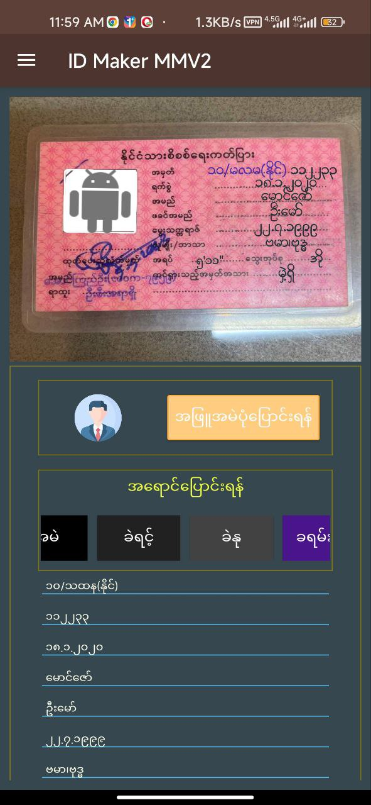
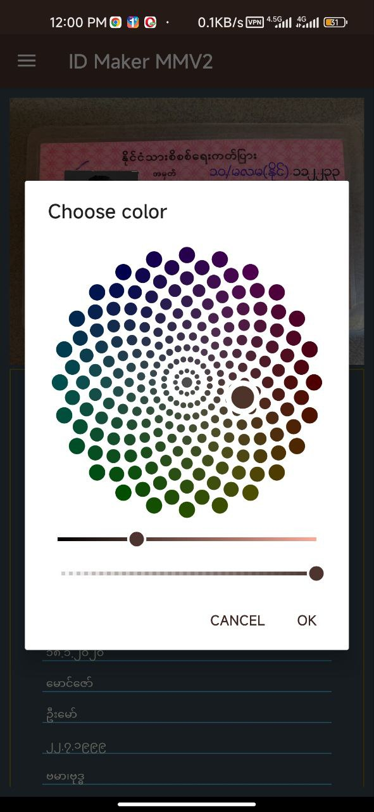

# IDMakerMM-free-
<html>
  <head></head>
  <body class="dv" style="background:brown;">
  <h1>This app is used for making fake Myanmar National ID Card.</h1>
  

  <h2>The purpose is using for ligel only.</h2>
  
  

Using in iligel crimes are not depend on a developer

This is free Version.So, some features are not perfect.

 <h2> In Pro-Version.</h2>

1.Upload Custom Images.

2.Built In 4 fonts.

3.Colorpicker for texts.

4.Front side and back side.

5.Telegram membership.

6.Touch and moveable photo and texts

  </body>
 
</html>
